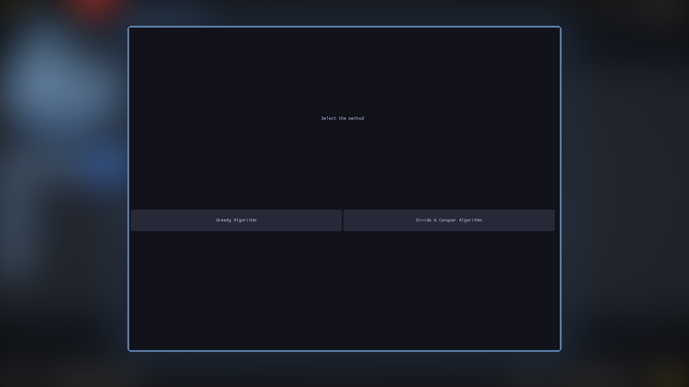
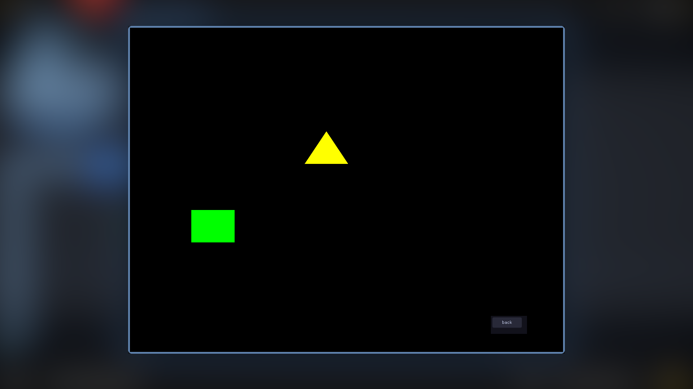
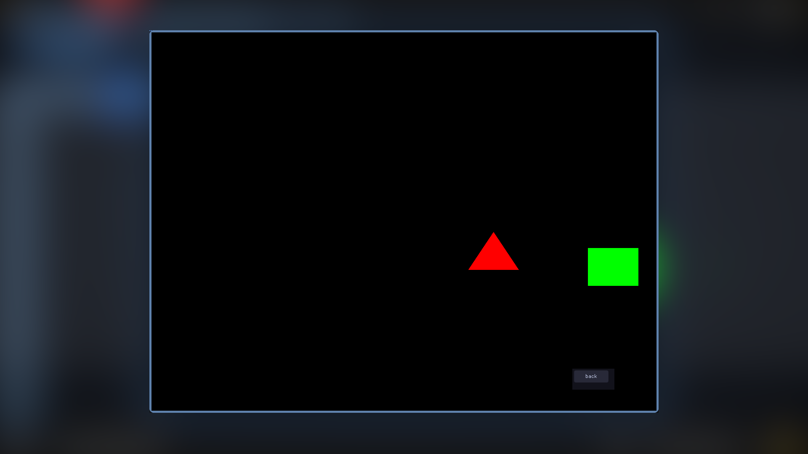

### فارسی👇

<h1>تفاوت الگوریتم حریصانه با الگوریتم تقسیم و حل</h1>

این یک پروژه کوچک دانشجویی برای مقایسه الگوریتم حریصانه با الگوریتم تقسیم و حل است.

<h2>نکته مهم در سیستم عامل‌های دیگر:</h2>

این پروژه در سیستم عامل لینوکس طراحی شده و اگر مشکلی در اجرای پروژه (در ویندوز یا مک) داشتید، می‌توانید فیلم ضبط شده آن را ببینید یا فایل PDF را بخوانید.

<h3>عکس‌ها</h3>

___
### English👇
# Difference between greedy or divide and conquer algorithms

**This is a small student project to compare the greedy algorithm with the divide-and-conquer algorithm.**

## Important note on other operating systems:
**This project is designed on the Linux operating system, and if you have any problems running the project (on Windows or Mac), you can watch the recorded video or read the PDF file.**

### Pictures

